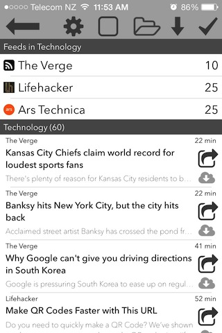
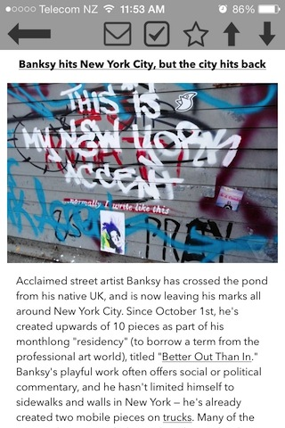

RSS-Feed-Reader (In Development)
================================

**This app is under active development and will be published to the app store soon!**

* This is my second major project, currently in development, expected to be available on the App Store in November 2013.
* As a power RSS user, I wanted to build an app to my own specifications, minimalizing UI, and introducing new efficient design ideas.
* Provides image caching for offline reading.
* Includes support for news aggregator services such as The Old Reader, Feedly, and TT-RSS.
* Supports sharing by Facebook, Twitter, or Email.
* Designed specifically for iOS 7 & retina displays.
* Utilizes asynchronous network connections for fetching feeds and caching images.
* I am currently working on increasing performance by integrating multi-threading for feed parsing as well as integrating additional web service APIs for aggregation, sharing, and read-it-later services.
* Code samples available on request.

	